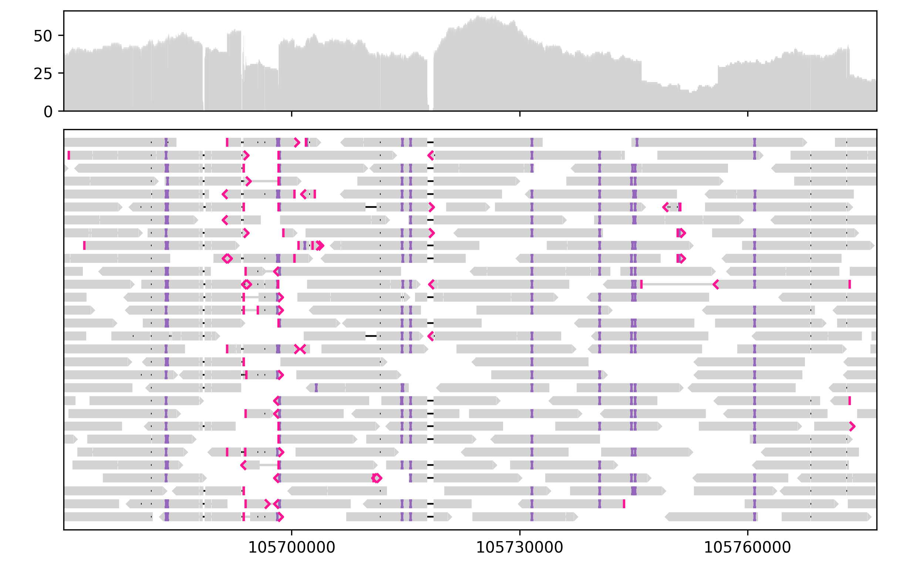

# Lakeview

[](https://github.com/jzhang-dev/lakeview/actions/workflows/run_pytest.yml)

Lakeview is a Python 3 library for creating publication-quality [IGV](https://software.broadinstitute.org/software/igv/)-style genomic visualizations. Lakeview is based on [Matplotlib](https://matplotlib.org/). 

A quick example:

```py
# Import Lakeview
import lakeview as lv

# Load aligned segments in a selected region from a BAM file
painter = lv.SequenceAlignment.from_file(
    "PacBio_HiFi.bam", region="chr14:105,660,000-105,780,000"
)
# Create an empty GenomeViewer with two tracks
gv = lv.GenomeViewer(tracks=2, figsize=(8, 5), height_ratios=(1, 4))
# Plot alignment pileup
painter.draw_pileup(
    gv.axes[0],             # Plot on the first track of the GenomeViewer
    show_mismatches=False,  # Do not highlight mismatched bases
)
# Plot aligned segments
painter.draw_alignment(
    gv.axes[1],             # Plot on the second track of the GenomeViewer
    show_mismatches=False,  # Do not highlight mismatched bases
    sort_by="length",       # Plot longer reads first
    link_by="name",         # Link primary and supplementary alignments of the same read
    max_rows=30,            # Only show the first 30 alignment rows
)
# Adjust x axis limits
gv.set_xlim(105_670_000, 105_777_000)
# Save the plot
gv.savefig("example.png")
```



Lakeview currently supports visualzing sequence alignment, pileup, and gene annotation tracks. Additional functionality will be added in the future. 

Try Lakeview interactively with Binder:

[](https://mybinder.org/v2/gh/jzhang-dev/lakeview/HEAD)
 

## Features

- **Improved clarity**. Lakeview inherits the familiar and intuitive visual style of [IGV](https://software.broadinstitute.org/software/igv/), with a clear layout designed for publication and presentation. 
- **Programmable plotting**. Multiple files and genomic regions can be visualized automatically through a Pythonic interface inspired by [Seaborn](https://seaborn.pydata.org/) and [Pandas](https://pandas.pydata.org/).
- **Support for remote data**. Genomic data are often stored in remote servers without display devices. With Lakeview, you can plot remotely and view the output figures locally. Lakeview works well with [JupyterLab](https://jupyterlab.readthedocs.io/en/stable/) to streamline this workflow. 
- **Transparency and reproduciblity**. Figures are plotted transparently and annotated explicitly. The input data and the plotting code contain all the information needed to reproduce the figure. 
- **Customizable layouts**. Lakeview supports many layouts implemented in [IGV](https://software.broadinstitute.org/software/igv/), while allowing the user to define custom rules for ordering, groupping, and coloring each segment. Advanced customization is possible via the [Matplotlib](https://matplotlib.org/) API.

## Installation

```sh
pip install lakeview
```

## Documentation

Lakeview documentation is available at https://jzhang-dev.github.io/lakeview/.

## Contribute

Issues and pull requests are welcome via [GitHub](https://github.com/jzhang-dev/lakeview/).

A ready-to-use development environment is available via Gitpod:

[](https://gitpod.io/#https://github.com/jzhang-dev/lakeview)

## License

Lakeview is licensed under the GPL-3.0 license. 

